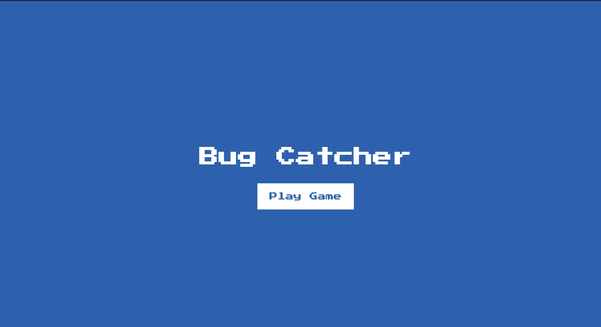

# Bug-Catcher



A silly game where players try to catch virtual bugs. Built with HTML, CSS, and JavaScript, this game challenges players with dynamic bug movements and increasing difficulty. With a retro design and engaging gameplay, it's a great project for learning DOM manipulation or showcasing game development skills.

## Key Features
- **Choose Your Bug**: Select from various bug types like flies, mosquitoes, spiders, and cockroaches to begin the game.
- **Dynamic Bug Spawning**: Bugs appear at random positions with random rotations, making them challenging to catch.
- **Time and Score Tracking**: Displays the elapsed time and your current score in real-time.
- **Increasing Difficulty**: Catching bugs spawns more bugs, adding to the challenge.

## Technologies Used
- **Frontend**: HTML, CSS (with retro-styled design and animations).
- **JavaScript**: Handles game logic, bug spawning, scoring, and difficulty scaling.

## How to Run
1. Clone the repository:
   ```bash
   git clone https://github.com/yourusername/Bug-Catcher-Game.git
   cd Bug-Catcher-Game
   ```
2. Open `index.html` in your browser to start playing the game.

## Live Demo
Check out the [Live Demo here:](https://chrisroland.github.io/Bug-Catcher/)

## Contributions
- Feel free to **open issues** for any bugs or feature requests.
- **Pull requests** are welcome for adding new bugs, levels, or features.
- This project is **open-sourced**, and I appreciate **constructive feedback** and **collaborations**!

Thank you for exploring this project! ❤️